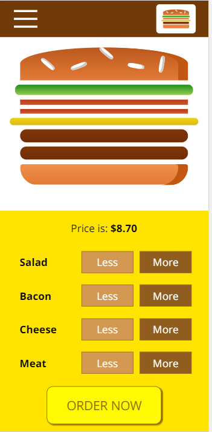
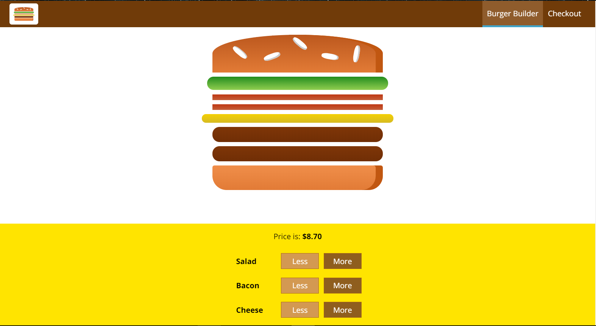
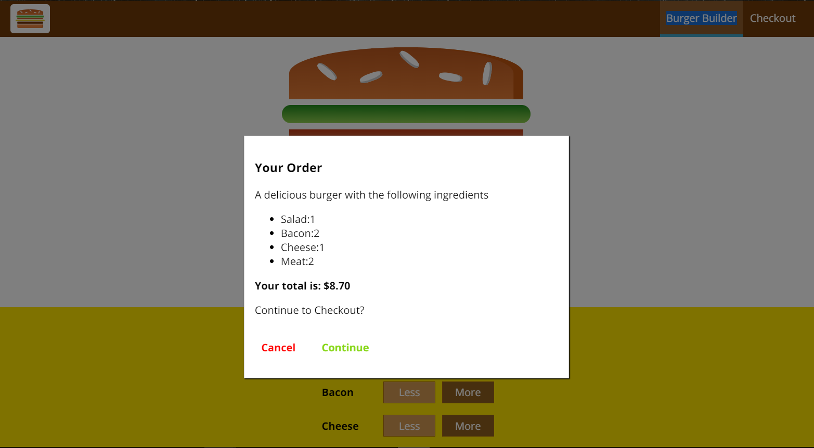

# ReactJS-BurgerWorld-BurgerBuilder
First ReactJS application.

Demonstrates many core React JS principles such as: the decoupling of application structure via React Components, enabling components to communicate with each other via props, passing method references to components, auxiliary higher order components, ReactJS lifecycle update methods like shouldComponentUpdate() to test if a DOM element should be updated based on if it is being shown or not.

Reacts dynamically to page size and is compatible with both mobile and web browsers, and makes use of CSS modules to add styling dynamically to React Components.

WIP!

  

  

  

